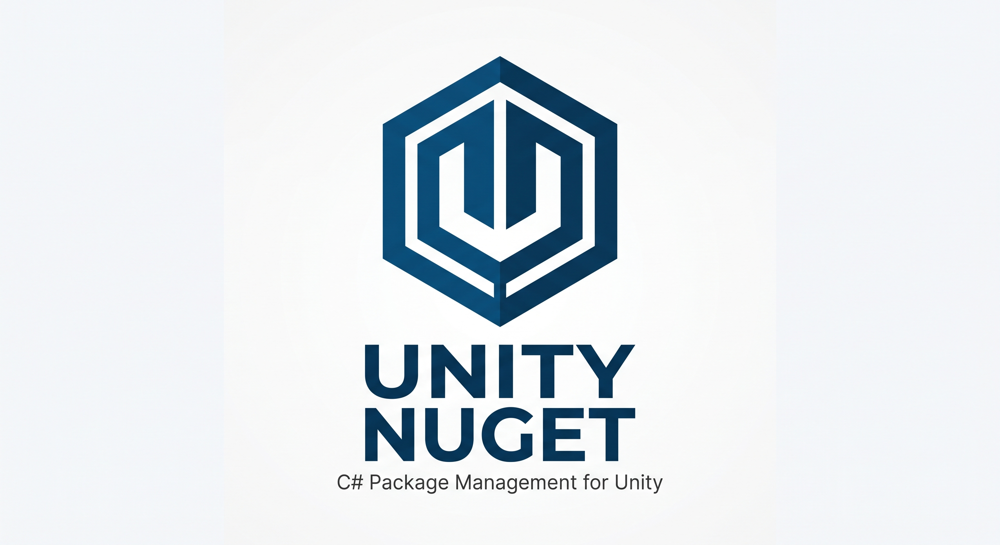

# Unity NuGet

Unity NuGet (ADK) is a lightweight, reusable Unity Editor package manager for discovering, installing, restoring, updating, and removing managed NuGet packages directly inside Unity projects. It provides a native, zero-dependency workflow within Unity Editor using an independent implementation, project settings model, package layout, dependency tracker, and editor UI.

## Purpose

- Search NuGet.org directly from the Unity Editor.
- Browse package metadata and available versions.
- Install a selected package and recursively resolve its NuGet dependencies.
- Prefer Unity-compatible managed framework assets from `lib/` or `ref/`.
- Extract managed assemblies and native runtime assets into a configurable folder under `Assets/`.
- Persist the install location and package preferences automatically per Unity project.
- Restore tracked packages after a clean checkout or deleted package assets.
- Track direct and dependency packages and display their dependency graph.
- Check direct installs for newer package versions and update them from the Editor UI.
- Reuse the tool across projects as a UPM Git dependency.

## Setup

### Unity Package Manager via Git URL

In Unity, open **Window > Package Manager**, select **+ > Add package from git URL...**, then enter:

```text
https://github.com/ADK-OS/Unity-Nuget.git
```

You can also add it directly to `Packages/manifest.json`:

```json
{
  "dependencies": {
    "com.asheshdevelopment.adk-unity-nuget": "https://github.com/ADK-OS/Unity-Nuget.git"
  }
}
```

## First Launch and Install Location

Open **NuGet > Open Package Manager...**.

On the first launch in a project, Unity NuGet automatically creates and saves its project settings with this default install location:

```text
Assets/Plugins/ADKUnityNuget
```

The path must remain inside the current project's `Assets/` folder. It can be changed at any time through **NuGet > Project Settings...** by typing an Assets-relative path or selecting **Browse...**.

Settings are automatically saved to:

```text
ProjectSettings/ADKUnityNugetSettings.json
```

When the install location is changed and the previous package directory already exists, Unity NuGet migrates that directory to the new location. A non-empty target folder is rejected to avoid overwriting unrelated project assets.

## NuGet Menu

Unity NuGet adds a dedicated top-level **NuGet** menu:

- **Open Package Manager...** — opens the main Online / Installed / Updates window.
- **Restore Project Packages** — restores all directly tracked packages and their dependencies.
- **Explore Dependency Graph...** — displays tracked direct/dependency relationships.
- **Check Installed Package Updates...** — opens the Updates tab and immediately scans direct installs.
- **Project Settings...** — opens project-scoped Unity NuGet settings.
- **About ADK Unity Nuget** — displays package version information.

## Package Manager Window

The editor window uses three focused views:

### Online

Search NuGet.org, inspect package descriptions/authors/download counts, choose a version, and install it into the configured Assets location.

### Installed

Review direct installs and dependencies, filter the list, restore tracked packages, or remove a selected package.

### Updates

Scan all directly installed packages in parallel, compare installed versions with NuGet.org, and update individual packages.

## Package State

Project installation state is stored in:

```text
ProjectSettings/ADKUnityNuget.json
```

The manifest tracks package ID, version, whether the package was installed directly or as a dependency, and the package dependency IDs used by the dependency graph.

## Framework Selection

Unity NuGet prefers common Unity-compatible target frameworks in this order:

`netstandard2.1`, `netstandard2.0`, `net48`, `net472`, `net471`, `net47`, `net462`, `net461`, `net46`, `net452`, `net45`, then other compatible-looking managed targets.

If a package has no `lib/` or `ref/` assets, it may still install native assets, but packages that depend on build targets, MSBuild transforms, analyzers, source generators, or platform-specific NuGet install scripts are not fully supported.

## Semantic Versioning (SemVer 2.0.0)

This project strictly adheres to the [Semantic Versioning 2.0.0 Specification](https://semver.org/#semantic-versioning-200):

$$\text{MAJOR}.\text{MINOR}.\text{PATCH}$$

1. **MAJOR** (`x.0.0`): Incompatible API changes, major architectural redesigns, breaking manifest schema changes, or bumped minimum Unity engine version requirements.
2. **MINOR** (`0.x.0`): New features, namespace refactoring, non-breaking workflow enhancements, new editor windows, and backwards-compatible improvements.
3. **PATCH** (`0.0.x`): Backwards-compatible bug fixes, performance optimizations, documentation updates, and patch-level stability fixes.

Internal package resolution and sorting also implement full SemVer 2.0.0 precedence rules (numeric identifier comparison, dot-separated pre-release segments, and build metadata exclusion).

## Progress Tracking & Development Status

| Feature / Milestone | Version | Status | Description |
| :--- | :---: | :---: | :--- |
| **NuGet.org v3 Search & Metadata** | `0.1.0` | Done | Search packages, query version indices, display descriptions and downloads. |
| **Recursive Dependency Resolution** | `0.1.0` | Done | Parse `.nuspec` XML, extract framework-specific dependencies recursively. |
| **Framework Compatibility Scoring** | `0.1.0` | Done | Automatic prioritization of `.NET Standard 2.1/2.0` and `.NET Framework`. |
| **3-Tab Editor Package Manager UI** | `0.2.0` | Done | Online discovery, Installed management, and Update checking in `ADKUnityNugetWindow`. |
| **Project Settings Provider** | `0.2.0` | Done | Integrated with Unity Project Settings (`ProjectSettings/ADKUnityNugetSettings.json`). |
| **Safe Path Migration** | `0.2.0` | Done | Automatic asset directory relocation with non-empty destination guard. |
| **Dependency Graph Viewer** | `0.2.0` | Done | Interactive foldout tree view visualizing direct and transitive dependencies. |
| **Update Scanning & One-Click Upgrade** | `0.2.0` | Done | Parallel version query for all direct installs. |
| **Namespace Refactor (`ADKUnityNuGet`)** | `0.3.0` | Done | Unified clean namespace across all C# code and assembly definition. |
| **Repository URL & Rebranding** | `0.3.0` | Done | Updated repo link to `ADK-OS/Unity-Nuget` and standardized branding. |
| **Progress & SemVer Documentation** | `0.3.0` | Done | Detailed changelog and tracking matrices for release management. |
| **Transitive Dependency Pruning / GC** | `0.4.0` | Planned | Automatic cleanup of orphaned dependencies when root packages are removed. |
| **Plugin Platform Import Settings** | `0.4.0` | Planned | Automated `PluginImporter` RID platform configuration for native runtimes. |
| **Private & Authenticated NuGet Feeds** | `0.5.0` | Planned | Support custom package sources (Azure DevOps, GitHub Packages, BaGet). |

## Dependencies

Unity NuGet has zero third-party package dependencies. It uses Unity Editor APIs and standard .NET APIs available to supported Unity versions.

NuGet packages installed through the tool may have their own licenses and dependencies. Review each package's license before redistribution.

## Version

Current package version: `0.3.0`.

Minimum declared Unity version: `2021.3`.

## Limitations

- NuGet.org is currently the default package source.
- Authenticated/private feeds are planned for upcoming releases.
- NuGet `packages.config`, MSBuild `.targets`/`.props`, install scripts, analyzers, and source generators are not executed.
- Dependency range handling covers standard NuGet interval syntax and plain minimum versions, but remains intentionally lightweight rather than a complete NuGet resolver.
- Native runtime assets are copied, but Unity import/platform settings are not automatically customized per RID.
- Removing a direct package does not automatically garbage-collect dependencies because another package may still rely on them.
- Assembly compatibility ultimately depends on the target Unity version, scripting backend, API compatibility level, platform, and the NuGet package itself.

## Repository

`ADK-OS/Unity-Nuget` — [https://github.com/ADK-OS/Unity-Nuget.git](https://github.com/ADK-OS/Unity-Nuget.git)

## License

MIT License. See [LICENSE](LICENSE).
